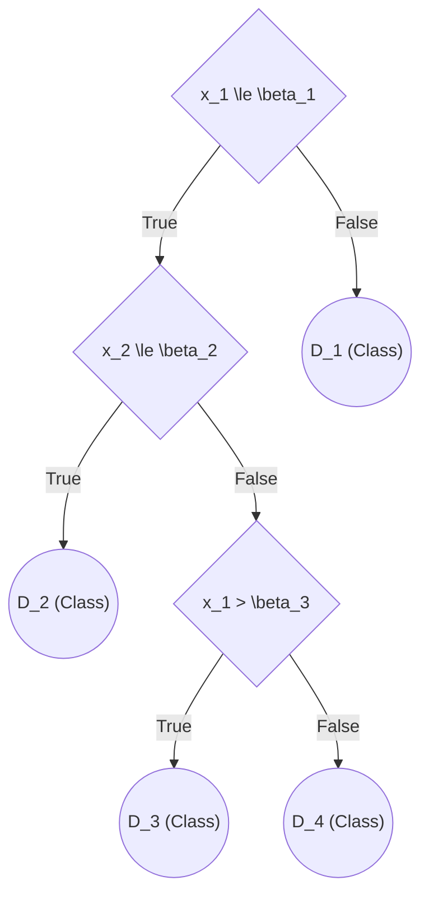

# Topic Summary: Learning from Observations

This document summarizes key concepts in "Learning from Observations", focusing specifically on **Decision Tree Learning**, **Attribute Selection (Entropy & Information Gain)**, **Overfitting**, and **Model Evaluation Techniques**.

## 1. Decision Tree Learning 🌳

A **Decision Tree** is a non-parametric, supervised machine learning algorithm that represents a function mapping a vector of input variables to a decision output. It belongs to the class of recursive partitioning algorithms.

*   **Structure:**
    *   **Non-leaf Nodes (Decision/Split Nodes):** Apply exactly one test condition to one input variable/attribute.
    *   **Leaf Nodes:** Serve as the output nodes assigning a class label or continuous value.
*   **Types of Decision Trees:**
    *   **Classification Tree:** The output variable is categorical (e.g., Boolean `True/False`). 
    *   **Regression Tree:** The output variable is continuous.
*   **Decision Boundaries:** Decision trees form piecewise constant separators. As the tree grows deeper, more piecewise separators are built into the decision boundary, providing highly non-linear separation.

### Building Decision Trees
Decision trees use a top-down, greedy approach:
1.  **Assess candidate inputs:** Evaluate the best way to split the data (using a measure of purity).
2.  **Split:** Divide the data into two or more subgroups based on the selected condition.
3.  **Recurse:** Pick a subgroup and repeat the process.
4.  **Terminate:** Stop when all records in a node belong to the same output class or other stopping criteria are met.

Below is an illustration of a generic decision tree built based on features $x_1$ and $x_2$:

---

## 2. Purity Measures: Entropy & Information Gain 📊

To determine the "best" attribute for splitting the data at each node, we need mathematically defined purity measures. 

### Entropy ($H$)
Entropy measures the amount of uncertainty, impurity, or randomness in a dataset. 
For a dataset $S$ with a binary output target containing positive ($p$) and negative ($n$) examples:

$$ H(S) = - \left( \frac{p}{p+n} \right) \log_2 \left( \frac{p}{p+n} \right) - \left( \frac{n}{p+n} \right) \log_2 \left( \frac{n}{p+n} \right) $$

* **$H(S) = 0$**: The set is perfectly pure (all examples belong to the same class).
* **$H(S) = 1$**: The set is completely impure (50% positive, 50% negative).

### Information Gain ($IG$)
Information Gain measures the expected reduction in entropy caused by splitting the dataset $S$ according to a given attribute $A$. The decision tree algorithm picks the attribute with the **highest** Information Gain.

$$ IG(S, A) = H(S) - \sum_{v \in Values(A)} \frac{|S_v|}{|S|} H(S_v) $$
Where:
*   $Values(A)$ is the set of all possible values for attribute $A$.
*   $S_v$ is the subset of $S$ for which attribute $A$ has value $v$.

---

## 3. Generalization: Overfitting & Underfitting 🎛️

While decision trees are highly flexible, they are prone to generalizing poorly if not carefully tuned.

*   **Underfitting:** The learned model is too simple to capture the true underlying relationships between the input attributes and the class labels.
*   **Overfitting:** The model is overly complex and captures specific noise/anomalies in the training data rather than true underlying patterns. It performs well on training data but poorly on unseen test data.

### Factors that influence Overfitting:
1.  **Limited Training Size:** A small dataset provides a limited representation of the overall data distribution, making it easier for the tree to memorize noise.
2.  **High Model Complexity:** Models with a huge number of parameters (e.g., decision trees with a large number of leaf nodes and complex test conditions) tend to learn highly specific boundaries that fail to generalize.

---

## 4. Addressing Overfitting: Pruning ✂️

To reduce overfitting due to high model complexity, we use **Pruning** — the process of removing nodes from the tree to limit its size.

### Pre-pruning (Early Stopping)
*   The tree is pruned **while** it is growing.
*   The algorithm stops splitting nodes when it reaches a predetermined complexity threshold (e.g., maximum depth limit, minimum samples per leaf, or a purity threshold).

### Post-pruning
*   The decision tree is initially grown to its maximum possible size.
*   Trimming happens **bottom-up**. A subtree is replaced by a new leaf node (labeled with the majority class of the subtree) if removing it does not worsen the generalization error estimates.
*   The process stops when there is no further improvement in error estimates beyond a certain threshold.

---

## 5. Model Evaluation: Cross Validation 🔄

To evaluate a model without bias, the data must be rigorously divided. Generally, data is split into:
1.  **Training Set:** Used to train the decision tree recursively.
2.  **Validation Set:** Used to tune parameters, test hypotheses, and perform pruning.
3.  **Test Set:** Kept securely locked away until training/tuning is complete to provide an unbiased final evaluation.

### k-Fold Cross Validation
A popular method used to maximize validation accuracy when data is limited:
1.  Partition the dataset evenly into $k$ equal subsets (folds).
2.  For $i = 1 \dots k$:
    *   Train the model on $k-1$ subsets.
    *   Validate the model on the remaining $1$ subset.
3.  Average the evaluation metric (like accuracy or error rate) across all $k$ trials to get a final performance estimate.
